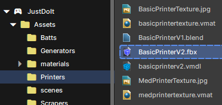
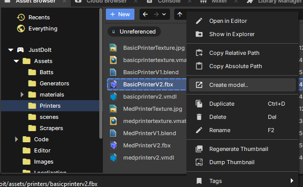
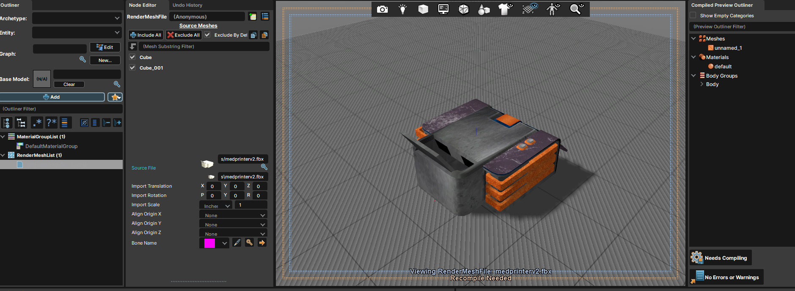

### 🧩 Adding a Model

#### Step 1: Import Your Model

- Drop the model (`.fbx`, `.obj`, etc.) and its textures into an appropriate subfolder inside `Assets/Models`.
- Name the folder based on the model's **use or type**.

#### Step 2: Create the `.vmdl`

- Right-click the **main model file** and choose **"Create Model..."**.
- This generates a `.vmdl` — the format Source 2 uses for in-game models.

#### Step 3: Fix Materials (if needed)

- Double-click the `.vmdl` file or open it in **ModelDoc**.
- If textures aren't displaying correctly:
  - Change the **Material Group** or default material to the correct one.
  - If there are extra material groups, remove them.
  - Click **"Needs Compiling"** to update changes.

