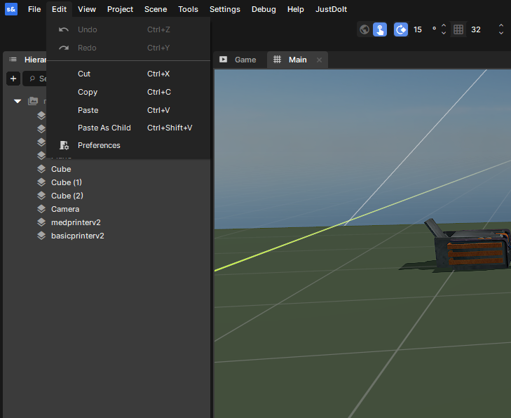
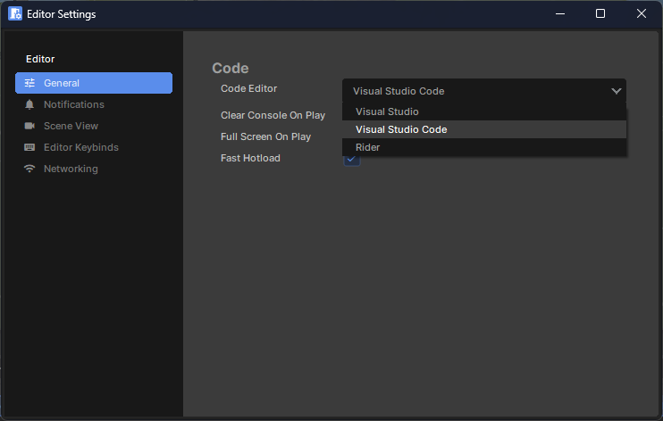
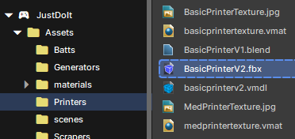
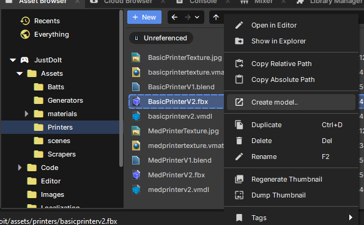
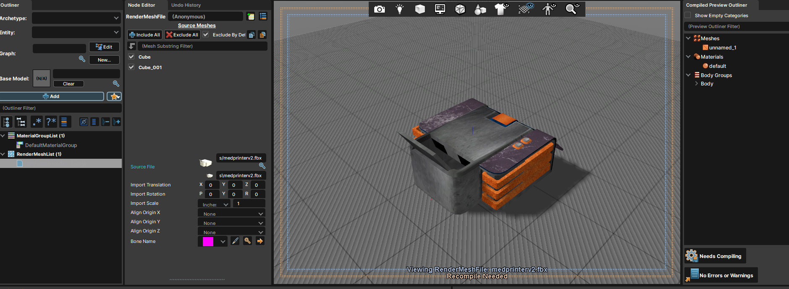
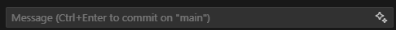
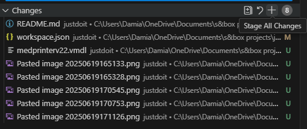
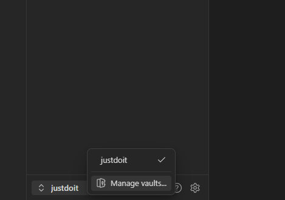
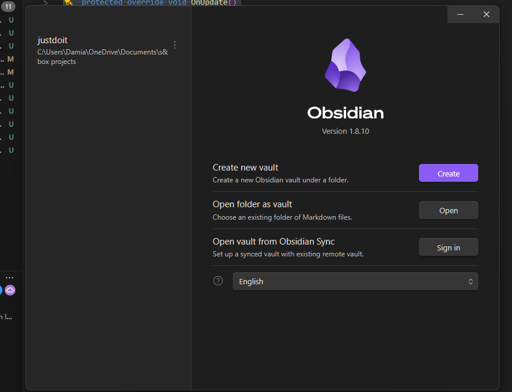

# 🛠️ justdoit - *Just Complete One Project*

Welcome to our S&Box project template and testbed.  
This repo is set up to help multiple people work together effectively on a single project — including game systems, models, and documentation.

---

## 📦 Project Structure.  
├── Assets/  
│ ├── Models/  
│ ├── Textures/  
│ └── Sounds/  
│  
├── Code/  
│ ├── Components/  
│ └── Prefabs/  
│ └── Scripts/  
│  
├── Images/  
├── README.md  
└── .vscode/

- **Assets**: Files created outside the engine (models, textures, sounds).
- **Code**: Game logic, prefabs, and reusable components written in C#.
- **Images**: Screenshots and reference images for documentation.

---

## 🎮 Part 1 - S&Box Setup

### Set Default IDE to Visual Studio Code

1. Go to `Edit` > `Preferences`.
2. Under the **General** tab, set your **Code Editor** to `Visual Studio Code`.

  

---

### 🧩 Adding a Model

#### Step 1: Import Your Model

- Drop the model (`.fbx`, `.obj`, etc.) and its textures into an appropriate subfolder inside `Assets/Models`.
- Name the folder based on the model's **use or type**.

#### Step 2: Create the `.vmdl`

- Right-click the **main model file** and choose **"Create Model..."**.
- This generates a `.vmdl` — the format Source 2 uses for in-game models.

#### Step 3: Fix Materials (if needed)

- Double-click the `.vmdl` file or open it in **ModelDoc**.
- If textures aren't displaying correctly:
  - Change the **Material Group** or default material to the correct one.
  - If there are extra material groups, remove them.
  - Click **"Needs Compiling"** to update changes.

✅ Done! You can now use your model wherever a mesh is needed.

---

## 💻 Part 2 - Visual Studio Code & Git

### Source Control Workflow

1. Press `Ctrl+Shift+G` or click the **Source Control** tab in VS Code.
2. Stage changes using the **+** button.
3. Commit your changes — use the ✨ icon to auto-generate a message if needed.
4. Push or pull changes to sync with GitHub.

  

---

## 🧠 Part 3 - Obsidian Notes

We're using **Obsidian** to manage all project documentation.  
If you want to contribute using Obsidian:

1. Download and install [Obsidian](https://obsidian.md).
2. Click `Manage Vaults` → `Open Folder as Vault`.
3. Select the project folder.

  

📌 When adding images to any notes or readmes, please move them to the `Images/` folder so they stay organized.

---

## ✅ Tips

- **Use folders** for everything — it keeps the project clean and searchable.
- **Name things clearly** so both of us (and future contributors) understand what they are at a glance.
- **Commit often**, and use helpful messages — even autogenerated ones help with tracking changes.

---

## 🌐 Outside Links

Here are some helpful links related to tools, docs, and external resources:

- [Obsidian](https://obsidian.md/) — Markdown-based note-taking tool we're using for project docs.
- [Visual Studio Code](https://code.visualstudio.com/) — Our recommended code editor for working on the project.
- [S&Box](https://sbox.game/) — The game platform we're building on.
- [S&Box Dev Docs](https://sbox.game/dev/doc) — Official documentation for development.
- [S&Box Cheat Sheet](https://sbox.game/dev/doc/code/code-basics/) — Quick reference for coding in S&Box.
- **Internal Docs** — Coming soon: `tbd.com`

---
Let’s just complete **one** project.  
Then we can do it again. 🚀